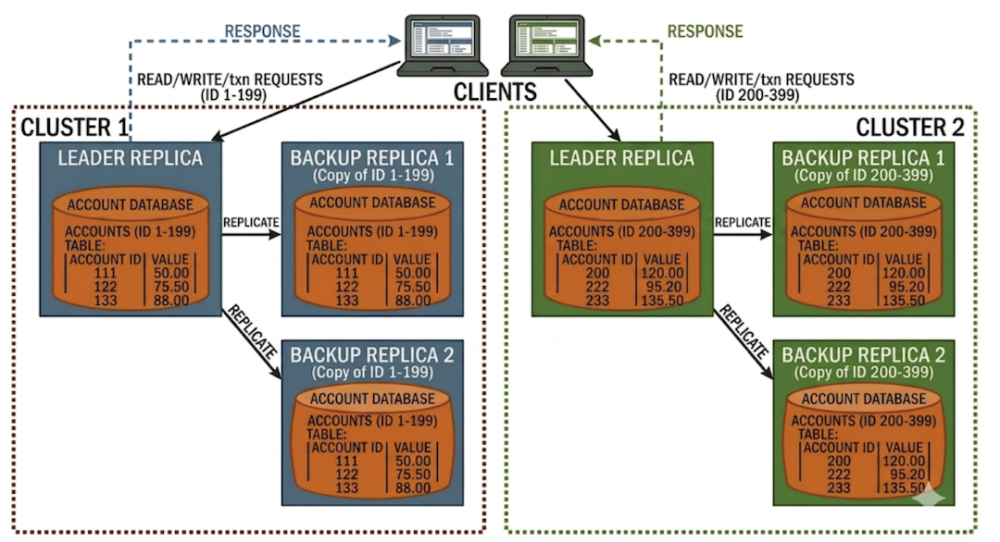

# Distributed Transaction Processing System

This project implements a distributed transaction processing system using Multi-Paxos-based consensus within clusters and Two-Phase Commit (2PC) for handling cross-shard transactions.

## Overview

- **Consensus:** Each cluster uses Multi-Paxos to agree on transaction order.
- **Sharding:** Data is partitioned across multiple clusters (shards).
- **Cross-Shard Transactions:** Transactions spanning multiple clusters use 2PC for atomicity.
- **Benchmarking:** A generation engine to test performance under different workloads

## System Design



We use a sharded structure with c clusters. Nodes within a single cluster replicate a shard — a subset of the system state — so each cluster is a replica group responsible for that shard. Intra-cluster agreement is achieved with Multi-Paxos; cross-shard (cross-cluster) transactions are coordinated using Two-Phase Commit.

## How to Run

Before running the project, ensure that you have consistent versions of **protobuf** and **gRPC** installed on your system. Mismatched versions may cause build or runtime errors. Refer to your language's documentation for installation and version management instructions.

Build the program via

```bash
mkdir build && cd build 
cmake ..
make -j4
```

### Trace Logging

Trace output is off by default: every `LOG` statement is compiled out, so the default build
prints only command output and real errors. To build with traces compiled in, configure with
`-DPAXOS_TRACE=ON` in a separate build directory:

```bash
cmake -S . -B build_trace -DPAXOS_TRACE=ON
cmake --build build_trace -j4
```

Then run `./build_trace/paxos_node ...` for the traced binary or `./build/paxos_node ...` for
the quiet one. Since `PAXOS_TRACE` is cached, switching a directory back and forth requires
reconfiguring it with `-DPAXOS_TRACE=OFF` (or deleting the directory) — keeping two build
directories avoids that.  

## Usage

```bash
./paxos_node <testfile> <num_nodes_per_cluster> <num_clusters> <benchmark (0|1)> <num_txns_for_bench> <readonly_frac> <x-shard_frac> <skew>
```

- `<testfile>`: Path to the input file with transaction definitions.
- `<num_nodes_per_cluster>`: Number of nodes in each cluster.
- `<num_clusters>`: Number of clusters (shards).
- `<benchmark>`: Set to 1 to enable benchmarking, 0 otherwise.
- `<num_txns_for_bench>`: Number of transactions to run in benchmark mode.
- `<readonly_frac>`: Fraction of transactions that are read-only (0.0 - 1.0).
- `<x-shard_frac>`: Fraction of transactions that are cross-shard (0.0 - 1.0).
- `<skew>`: Skew parameter for transaction distribution.

## Interactive Commands

The program pauses between transaction sets (and after the final set) with the prompt
`Enter command to get up to and including set <N>:`. Arguments are space-separated, so use
`PrintBalance 4005` rather than `PrintBalance(4005)`.

| Command | Description |
| --- | --- |
| `PrintBalance <item_id>` | Prints the balance of that data item on all 3 nodes of its cluster (untouched items report the initial balance of 10). |
| `PrintDB` | Prints the data items modified in this test case on all 9 nodes. |
| `PrintView` | Prints every new-view message exchanged since the start of the test case, one per leader election. |
| `Performance` | Prints throughput and latency for the set just completed, measured from the client's first transaction to its last reply. |
| `PrintReshard` | Triggers resharding and prints a triplet `(item_id, source_cluster, dest_cluster)` for each item that moved, then applies the new shard map. |
| `PrintLog <node_id>` | Prints the log state of a single node. |
| `PrintStatus <seq_num>` | Prints the status of that sequence number on every node. |
| `Continue` | Resumes execution with the next set. |

## Features

- Multi-Paxos consensus for intra-cluster agreement
- Two-Phase Commit for cross-shard atomicity
- Configurable benchmarking and workload parameters
- Custom cluster configurations
- Resharding via hypergraph partitioning

## Integration Tests

To run the integration tests, ensure the binary is built and dependencies are installed, then from the project root:

```bash
pip install -r requirements.txt
pytest tests/integration/
```


## File Structure

```
2pc_paxos/
├── src/                  # C++ source (Paxos node, 2PC client, launch orchestration)
├── tests/
│   ├── integration/      # Python integration tests (pytest + pexpect)
│   └── test_data/        # Input CSVs defining transaction sets and node failures
├── database/             # SQLite databases persisted per node at runtime
├── build/                # Compiled output; paxos_node binary lives here after make
├── grpc/                 # gRPC third-party dependency
├── kahypar/              # Hypergraph partitioner dependency
├── CMakeLists.txt
└── requirements.txt      # Python test dependencies
```

## References

- [Paxos Made Simple](https://lamport.azurewebsites.net/pubs/paxos-simple.pdf)
- [Two-Phase Commit Protocol](https://en.wikipedia.org/wiki/Two-phase_commit_protocol)


